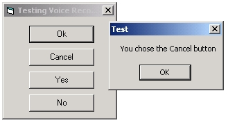



## Click buttons with your voice

### Description

This little example will click on any button just by saying the caption in a microphone. You will need Microsoft's Speech recognition engine. To fully understand how to make it work, I suggest you first read MTGiga's tutorial called 'Talk to your computer'. You can find it here.

http://www.planetsourcecode.com/vb/scripts/ShowCode.asp?txtCodeId=43096&lngWId=1

Don't forget to train the engine if you want it to better recognize how you speak. Of course this is just an example, it doesn't have code to put it in the tray.

Please leave comments and vote!
 
### More Info
 

             |
---                |---
**Submitted On**   |2003-02-13 11:17:46
**By**             |[Frédéric Côté](https://github.com/Planet-Source-Code/PSCIndex/blob/master/ByAuthor/fr-d-ric-c-t.md)
**Level**          |Beginner
**User Rating**    |4.5 (18 globes from 4 users)
**Compatibility**  |VB 6\.0
**Category**       |[Sound/MP3](https://github.com/Planet-Source-Code/PSCIndex/blob/master/ByCategory/sound-mp3__1-45.md)
**World**          |[Visual Basic](https://github.com/Planet-Source-Code/PSCIndex/blob/master/ByWorld/visual-basic.md)
**Archive File**   |[Click\_butt1543552132003\.zip](https://github.com/Planet-Source-Code/fr-d-ric-c-t-click-buttons-with-your-voice__1-43172/archive/master.zip)

